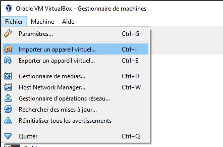
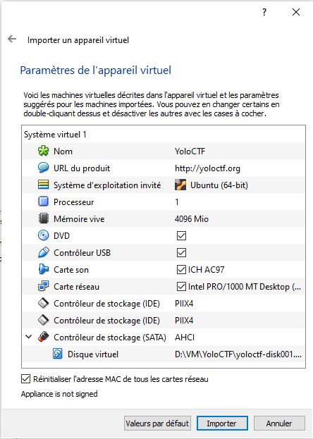
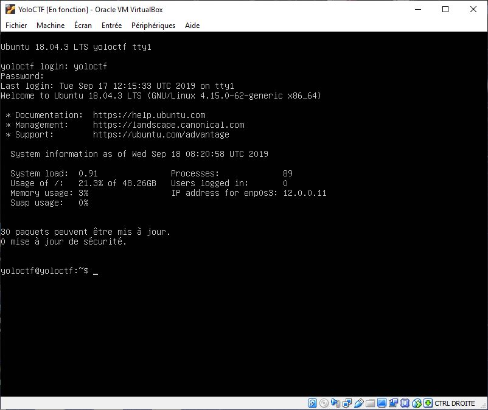
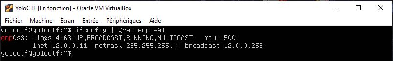
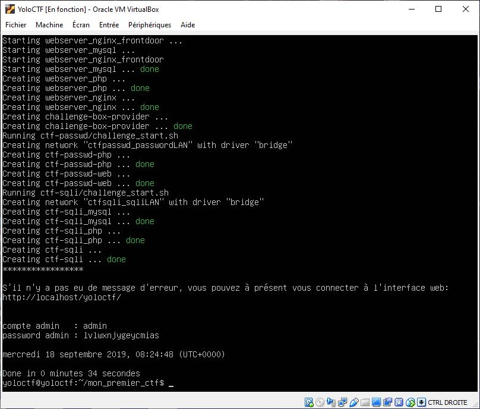

# Installation de la VM 

## Télécharger la VM


Télécharger https://yoloctf.org/yoloctf/iso/yoloctf.ova

Le fichier fait 4,4G. En fonction de votre liaison adsl/fibre ça peut prendre du temps.

Si nécessaire installer Virtualbox : https://www.virtualbox.org/

Lancer VirtualBox.



Dans Virtualbox faites: [fichier/Importer un appareil virtuel]

Selectionnez le fichier yoloctf.ova, faite [Suivant]



Cliquez sur Reinitialiser l'adresse MAC.
Puis [Importer]


Par défaut, la carte réseau est en mode bridge, et va se faire attribuer une adresse IP par votre routeur.

## Lancer la VM et obtenir l'adresse IP

Démarrer la VM.


Connectez vous avec le compte 'yoloctf' et le mot de passe 'yoloctf'.


Si vous n'êtes pas tout seul sur le réseau, changez le mot de passe:
```
# passwd
```

Identifiez l'adresse IP de votre serveur
```
ifconfig | grep enp -A 1
```


Ici c'est 12.0.0.11

## Personnaliser un peu la config

Vous pouvez personnaliser votre serveur Web en modifiant le fichier:
```
web_server/.env
```

### Code d'invitation 

Vous pouvez définir un code d'invitation pour filtrer les participants en enlevant le # en début de ligne.

```
# CTF_REGISTER_CODE=YOLO
```
```
CTF_REGISTER_CODE=MonCode
```


### Titre perso
Vous pouvez donner un titre perso à votre CTF en enlevant le # en début de ligne.

```
#CTF_SUBTITLE=Mon 2nd CTF
```
```
CTF_SUBTITLE=Montargis CTF
```

## Lancer le serveur

Démarrez le serveur
```
./ctf_run
```


Récupérez les identifiants du compte de l'administrateur du CTF:
- admin
- lvlwxnjygeycmias


Note : le serveur ssh étant activé, si vous connaissez l'IP de votre box, vous pouvez faire toutes ces manip à distance.
